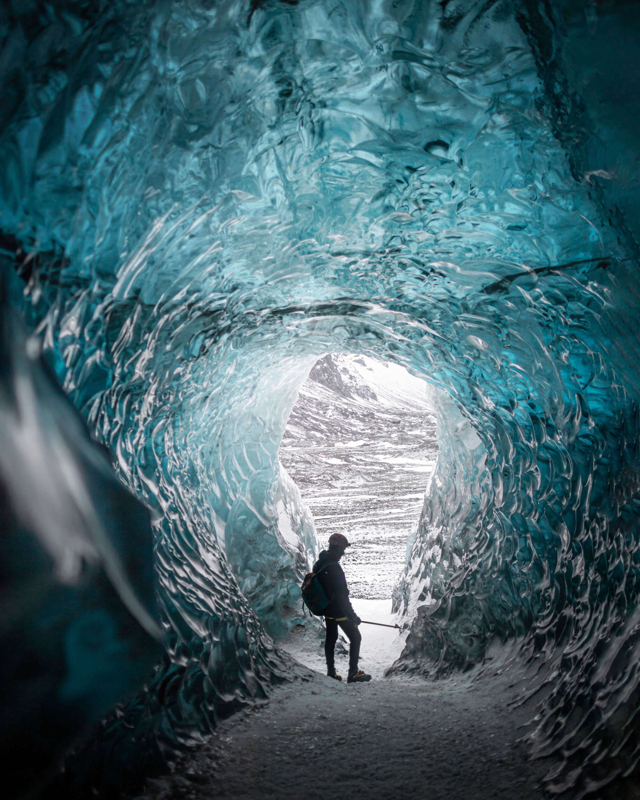

# Adventures

## Structure Reminder

The default rules for encounters recommend aiming for 6 to 8 medium to deadly encounters per long rest. If you seek a greater challenge, consider using the "Gritty Realism" variant, where a short rest is 8 hours and a long rest is 7 days.

Be mindful that weather is an important factor. Be sure to factor in the weather system.


**Encounters with Purpose** Encounters should:
- Create conflict
- Reinforce plot
- Add intrigue

### Check Template


| Check           | DC   | Result |
|-----------------|------|--------|
| **Str**         | ---- | ----   |
| Athletics       | ---- | ----   |
| **Dex**         | ---- | ----   |
| Acrobatics      | ---- | ----   |
| Sleight of Hand | ---- | ----   |
| Stealth         | ---- | ----   |
| **Int**         | ---- | ----   |
| Arcana          | ---- | ----   |
| History         | ---- | ----   |
| Investigation   | ---- | ----   |
| Nature          | ---- | ----   |
| Religion        | ---- | ----   |
| **Wis**         | ---- | ----   |
| Animal Handling | ---- | ----   |
| Insight         | ---- | ----   |
| Medicine        | ---- | ----   |
| Perception      | ---- | ----   |
| Survival        | ---- | ----   |
| **Cha**         | ---- | ----   |
| Deception       | ---- | ----   |
| Intimidation    | ---- | ----   |
| Performance     | ---- | ----   |
| Persuasion      | ---- | ----   |

### Module: Levels 1-4

- **Get to Netrus** Encounter undead, Kobolds, Fungi, Beasts, Madness.
- **Short Quest** "Save" animals for sled (potential werewolf encounter).
- **Acquire Sled** Meet warring tribes (Kobold, Lizardfolk, Yuan-ti).
- **Defend Netrus** Ideally with the help of an ally.

## Level One Adventure: Journey To Netrus

### Introduction

Your journey begins at **Thieves Key**, a notorious halfway point between the civilized world and the icy wilderness of Jhed. Perched in a cove with creaking piers and flickering lanterns, this is a place where **secrets are traded as often as goods**. Thieves, cutthroats, pirates, and outcasts gather here under the watchful eyes of **Brimhest Deepbrew**, the gruff, beer-stained dwarf who runs this lawless haven. Nothing happens here without Brimhest knowing, or at least approving.

The Thieves Key is not for the faint of heart. It's a dark, grimy port where ships come to unload illicit goods and repair battered hulls before venturing further south. The **Dockworks** are filled with the sound of hammering, shouting, and the creak of wooden ships. Dockworkers, visibly branded with marks of loyalty, toil under the ever-present threat of betrayal—a **caged corpse** with a sign reading "Traitor" serves as a stark reminder of what happens to those who cross the wrong people.

Overlooking it all is **Brimhest's Nest**, a lofty perch built into the cliffs, from where Brimhest watches the comings and goings of everyone in Thieves Key. To meet with Brimhest, you'll need to wait your turn in line, or if you're smart, grease the right palms to skip it. Below, in the **Loose Coin**, adventurers and thieves alike seek shelter, though the inn is little more than a series of shanty cubicles where **privacy is a luxury no one can afford**.

This is where your journey begins—a **final taste of warmth and drink** before stepping into the cold jaws of the Jhed Continent.

#### Why You're Here

For weeks, the smuggler's route between **Netrus**—a small but vital frontier town in Jhed—and Thieves Key has gone cold. The last crew sent with essential supplies and trade goods never returned. Netrus relies heavily on these deliveries to survive the harsh winters and trade their discoveries from the frozen wastes. If the route is not re-established, The town will collapse, and the situation is dire enough that Brimhest has approved your expedition to deliver a 50 lbs package critical to their survival.

You have been promised **600 gp** to deliver this package, with an additional **100 gp per extra crate** you can carry, but be warned: any lost cargo will cost you **150 gp in penalties**, and if the main package isn't delivered, the entire deal is void.

#### The Voyage: Thieves Key to the Witch’s Nip

Your next step is securing transportation to **The Witch’s Nip**, the entrance to the **Smuggler’s Tunnel** leading into Jhed. The tunnel is a vital lifeline between Thieves Key and the frozen continent, but first, you'll have to **sail across treacherous waters**. The journey to the Witch’s Nip is dangerous, as the waters surrounding Jhed are known to be frigid and volatile. 

You have a choice:
1. **Purchase a Sloop**: A small but sturdy vessel capable of carrying you and your cargo across the icy waters. You can negotiate with **Brimhest** or a local merchant, offering **100 gp** for a reliable boat.
2. **Acquire by Other Means**: If you're light on coin but heavy on wit, you may attempt to steal or barter for a sloop. There are opportunities to acquire a boat through **gambling**, **theft**, or **making a deal with the locals**, but doing so will put you on the radar of Thieves Key’s more unsavory characters.

**Sloop Features**:
- A sloop can comfortably carry your party and up to **500 lbs of cargo**.
- Requires a **sailor’s check** (Survival or Dexterity) to navigate the icy waters safely. Fail and your journey will take longer or take you where you do not want to go. 

#### Motivations for Your Journey

As you prepare for the perilous trek ahead, you each reflect on why you’ve taken this risk:

- **Fortune Seekers** Jhed promises unimaginable riches, from rare gems to ancient artifacts hidden beneath the ice. This expedition could set you up for life—if you survive.
  
- **Knowledge Seekers** The icy expanse of Jhed holds **arcane secrets and lost knowledge** from ancient civilizations. You’ve heard rumors of powerful magic trapped in the glaciers, waiting to be unlocked.
  
- **Exiles and Outcasts** Some of you have come to Jhed because there’s nowhere else to go. The world behind you holds **only danger or disgrace**, and the endless snow is the perfect place to disappear.
  
- **Adventurers and Survivalists** For you, Jhed is the **ultimate challenge**—a frozen wasteland that will test every skill and instinct you possess. You crave the thrill of survival against impossible odds.

Whatever your reason, you’ve banded together for this journey. The weather, the creatures, and even the very land itself will try to kill you, but together you might just survive.

### The Smuggler's Tunnel: Your First Steps Into Jhed

Your immediate goal is to reach **Netrus** by navigating the **Smuggler's Tunnel**, which starts at **The Witch’s Nip**, a foreboding entrance to an underground path leading into Jhed. Before you can even think about crossing into the frozen continent, you must survive the **two-day journey by boat** from Thieves Key, through treacherous waters and into the heart of **Roc territory**.

The **Roc**, a massive bird that patrols the skies over Jhed, is a constant threat, forcing smugglers to use these dangerous underground routes. Any attempt to travel overland would end in certain death beneath its talons.

From there, the **Smuggler’s Tunnel** will take you into **Netrus**, but it's a long journey through twisting, icy passages. The tunnel itself is not without its dangers, as **monsters, traps, and even the elements** will conspire to make the journey as deadly as possible.

#### Tasks Before You Leave

Before leaving Thieves Key, you need to make final preparations. You’ll have the chance to **purchase supplies**, gather **information**, and meet with key NPCs who may offer assistance—or try to sabotage your efforts.

- **Supplies**: Ensure you have enough food, cold-weather gear, and rations to last several days in freezing conditions. The journey to Netrus is long and treacherous.
- **Transport**: Secure or steal a sloop to sail to the Witch’s Nip. Don Vras, a seasoned smuggler with a **dark past**, may offer his services as a navigator.
- **Package**: Don’t forget the **50 lbs package** you’ve been entrusted to deliver. If anything happens to it, your mission will fail.
- **Information**: Speak with **Brimhest**, **Don Vras**, and others in the Thieves Key. They may offer **clues** about the dangers ahead, or tips on how to survive the journey. Some may even have ulterior motives.

### The Journey Begins

With your supplies packed and your nerves steeled, you prepare to leave Thieves Key. The smuggler’s boat awaits, its dark wood creaking as it sways on the icy water. Your last taste of warmth fades as the cold air of Jhed creeps closer. From here, you’ll travel through the **Smuggler’s Tunnel**, past the **UnderRoc Bridge**, and into the heart of **Netrus**.

Your quest is simple: **deliver the package**, survive the journey, and perhaps uncover the untold riches of the **frozen wilderness** beyond.

But beware—the last courier crew never made it back.

### Arrival at The Witch's Nip

After days at sea, navigating treacherous icy waters and avoiding the sharp gaze of the Roc, the sloop finally sails into a narrow inlet known as **The Witch’s Nip**. The biting cold seems to intensify as the boat glides between the towering, jagged cliffs that guard the cove like the fangs of a giant beast. As the crew secures the sloop to the frost-covered dock, a strange, echoing silence replaces the rhythmic lapping of the waves, broken only by the faint, distant howl of the wind.

Before you lies the entrance to the **Smuggler’s Tunnel**—a gaping, dark maw in the rock face, partially hidden by snow drifts and worn ice sculptures of unknown origin. The passage is lined with makeshift torch holders, though none are lit, casting the entire scene in a blue twilight glow. Deep within, the faint, rhythmic sound of dripping water is the only sign that the tunnel hasn't been abandoned for centuries.

#### The Smuggler's Tunnel

The **Smuggler’s Tunnel** is a lifeline between **Thieves Key** and **Netrus**, cutting through miles of treacherous terrain that would otherwise take weeks to navigate overland. While at first glance the tunnel may seem like a marvel of ancient craftsmanship, closer inspection reveals its more improvised nature. The stonework is uneven, as if hastily carved by many hands over time, with sections reinforced with mismatched materials. Cracks riddle the walls, and patches of ice creep in through the roof. A narrow river of freezing water snakes through the middle of the tunnel, glistening under the sparse light, barely held back by makeshift barriers.

Your journey through the tunnel will be as dangerous as the Roc-haunted skies above. The path ahead is dark, cold, and fraught with hazards—both natural and unnatural.

**The Tunnel’s Features:**
- The entrance is wide enough for a small boat to enter  and moor, but the river that flows within is more of a sluggish stream than a navigable waterway. It seems to be residual water seeping down from the higher parts of the tunnel.
- Much of the tunnel has an upward incline, making it more of a trek than a leisurely walk. The party will need to watch their footing, as patches of ice make travel treacherous.
- Crude, ice-coated railings line parts of the passage, hinting at past traffic, though they are worn and unreliable in many places.
- The residual water flows slowly but steadily, forming shallow pools and slick surfaces. Sharp rocks and ice floes occasionally jut out, making movement tricky. Any attempts to traverse the tunnel will require **Survival or Dexterity checks** to avoid slipping on the ice or navigating hazardous terrain.
- As the party ventures deeper, they discover that the tunnel isn’t as simple as a straight path. While the main passage stretches onward, there are occasional forks, offshoots, and side passages. These side tunnels lead into smaller alcoves or dead ends—remnants of old excavation attempts, collapsed tunnels, or secret storage areas from smuggling days gone by. Some forks are clearly marked with old **Thieves' Cant symbols** for those trained in its use.

As the party steps into the tunnel, the cold seems to tighten its grip around them. The sound of their boots crunching on the ice and the muted drip of melting snow echoes off the stone walls. The once-bustling trade route now feels eerily deserted, with only the fading remnants of ancient travel signs offering a hint of what once was.

As you prepare to enter, a single torch flares to life in the darkness—a reminder that **someone or something** may be waiting ahead.

### The First Challenge: The Cold

Before venturing too far into the tunnel, the party must brace themselves for the freezing temperatures. Each character must make a **Constitution Saving Throw (DC 10)** to resist the cold. Those who fail take **1 Cold Damage**. Warm clothing or magical protection from the cold can negate this check.

#### Encounter 1a: Boarded Walls

*DM Note*: This encounter is meant as a bypass to "A Wall of Ice" if players explore early or fail to climb up.

As the tunnel twists and narrows, the party will come across several makeshift wooden barriers erected by past smugglers and thieves. Each is marked with **Thieves’ Cant**, warning of the dangers ahead. A **Rogue** or anyone who can read the code will recognize the symbols, which indicate traps, potential ambushes, or secret passages hidden behind the walls.

Scattered along the path, **boarded walls** present a challenge: **destroy them and risk traps** or **find another way around**. Some paths behind the walls could be shortcuts, while others may hide deadly hazards. The decision is up to the players.

A rogue investigating can be told the result of their roll before destroying the blockade. Each path must be traveled for about 30 minutes before the result happens.



| D6 | Behind Wall |
|----|-------------|
| 1  | Too Cold    |
| 2  | Trap        |
| 3  | Dead        |
| 4  | Danger Hole |
| 5  | Split       |
| 6  | Bypass   |

1. **Too Cold** The path is long and cold. The party takes 1 Cold Damage.
2. **Trap** Investigation Check (DC 10) to notice the trap. Dexterity Save (DC 10) to avoid 1d4 Bludgeoning Damage as the roof caves in, making the path impassable.
3. **Dead** A corpse slumped to the ground, wearing scraps (Zombie). The party is surprised if they move towards it.
4. **Danger Hole** A half-eaten Kobold lies near a deep hole. Investigation (DC 13): There's water in the hole. It could trigger a Lizardfolk ambush.
5. **Split** The path splits in two. Each path requires a new D6 roll and can split again.
6. **Short Cut** An hour down the path reveals a shortcut. If the party has already found this, replace it with a "Too Cold" result.

### Ghost of the Past I

*DM Note*:  After the party wakes from their first short rest.

As the party rests for the first time inside the tunnel, something unsettling happens. In the stillness of the frozen caverns, as the campfire flickers and begins to die down, an ethereal form materializes. Barely visible, refracted through the ice walls, it speaks in a voice that is both chilling and mournful:

**"Will you be any different?"** it asks in **Old Common**, the words echoing in the icy wind. The figure lingers for only a moment before fading into the frozen darkness.

This ghostly figure does not engage the players directly but serves as a haunting reminder that many have come before them—and not all made it out.

#### Encounter 1b: A Wall of Ice

DM note: quick simple obstacle

The cavern opens wide with chunks of debris stacking up to 15ft slumped along a wall of ice. As if the passage was split by an immense tremor. The top of this wall of jagged ice seems 25ft above the highest pile of debris and a Kobold (two others hidden) can be seen taking interest before running off

1 Piercing Damage to Climb the Wall of Ice represented by the sharp terrain if just using Climb Speed

Athletics Check DC 13 to Climb, with some assistance and no climb speed (climbing gear, rope, pitons)

1d6 Bludgeoning Damage from fall on failed check, 2d6 bludgeoning damage if failed by 10 or more (3). This represents falling at the 10ft point, or 20ft point

You can make this more challenging by making Kobolds hide and shove (or cut rope) characters when they reach the top

| Check         | DC | Result                                        | DC | Result                              |
|---------------|----|-----------------------------------------------|----|-------------------------------------|
| Athletics        | 13 | on fail, 1d6 Bludgeoning damage                           | 3 | 2d6 Bludgeoning Damage             |
| Survival       | 13 | Climbable wall, but will hurt a bit              |    |                                     |
| Perception    | 16  | Shadows of Kobolds hint they are moving away |  |                                     |
| Investigation | 13 | Tracks lead back, and go into Boarded Walls (bypass)   |  |  |


#### Encounter 1c: Kresh and Krew

DM note: Use this option if party is stuck

The faint sound of iron against ice echoes before stalagtites above you buckles and breaks. Three hulking Lizardfolk fall from above.  
  
They only speak Draconic, but clearly have climbing gear, tools and will help the party for trade through gestures if no party member speaks draconic  
  
Kresh and Krew won't stick around to help the party further and dig down to the waters

Lizardfolk names should all start with "Kr"

#### Encounter 2: Remnants of the Trade Party

As the main tunnel forks, a Boarded Wall to the left is smashed open with trails of blood leading in both directions

Just a little past the Boarded Wall, tucked in an alcove is a makeshift wooden barrier with a few corpses (6) scattered about wearing tattered clothing of the Outer Empire. They have no weapons, armor or gold, as if picked clean, though it appears something taking large bites from the bodies (something Giant sized and smaller bites too)

If the party moves closer or investigates around the bodies 2-4 Zombies will surprise them

**Oniteth Scouter** - Female Goliath (frost) Survivor 

DM note: avoid giving another NPC a glaive

Behind the makeshift wooden barrier and through a crawlspace Oniteth is hidding, and will make his presence known calling for help. Oniteth is gaunt looking as if close to death, shaking while gripping his glaive (he will not give it up). Oniteth wears the garment of the Outer Empire

"Apologies and thank you, I hate it but I can't handle the frontline now. I have an important letter for Nick Elder of Netrus it is the only thing I could safeguard"

"I was stationed at UnderRoc searching for this group, something Giant started thrashing me about and I just took where I couldn't be grabbed"

| Check         | DC | Result                                        | DC | Result                                        | 
|---------------|----|-----------------------------------------------|----|-----------------------------------------------|
|Survival |10 | easily fortified for a Short Rest| --| --|
|Insight  |-- | she's in shock and trying to survive | 19 | she is hidding something |
|Investigation  |13 | Boarded Wall was broken from the outside | -- | -- |
|Medicine  |10 | Oniteth is Exhausted | 13 | Remnants of poison (unknown) powder on the dead   |

**Hostile:** will cast charm person / sleep / gaseous form to escape

#### Encounter 3a: UnderRoc Tower

DM Note: A series of 3 combats in one. Stay in initiative order, and if players don't act after 3 rounds, the Kobolds will act. Kobold's in J'hed should always involve traps. Kobold's will always attack to gain pact tactics and retreat when 1 is left
  
Charisma Checks Disadvantage if not using Draconic with Kobolds

| Weather | Normal | Lightly Obscure | Heavily Obscure |
|---------|--------|-----------------|-----------------|
| Fog     | 60ft   | 60ft+            | ----            |

| Part | Creature | #  | Notes            |
|------|----------|----|------------------|
| 1    | Kobold   | 4  | Hunters Trap     |
| 2    | Kobold   | 3+ | Alchemist's Fire |
| 3    | Kobold   | 6+ | Caltrops         |

The stone tower to the left is built into the icy cliffs, it appears to be two floors with arrow slits and vantage points. Domed and covered at the top 

**Bridge Entrance** 

Kobolds would rather complete a trade and run away. They search for food, treasures and dragons

| Check           | DC   | Result                                                   |
|-----------------|------|----------------------------------------------------------|
| **Dex**         | ---- | ----                                                     |
| Sleight of Hand | 13   | disarm Hunter Trap if noticed                            |
| Stealth         | 7    | party backs away to find another path                    |
| **Int**         | ---- | ----                                                     |
| History   | 16   | bridge built by Zeltrim Empire                                 |
| Investigation   | 13   | Hunters Trap in snow      |
| **Wis**         | ---- | ----                                                     |
| Insight         | 10   | Kobolds seem ready to move                               |
| Perception      | 10   | Kobolds speaking Draconic, waiting for Aspirant's orders |
| **Cha**         | ---- | ----                                                     |
| Intimidation    | 13   | Kobolds retreat into keep                                |
| Persuasion      | 10   | trade for passage**                                      |


**Trade:** Trade 1 Quest Crate, and one of the following, 

    all rations 
    all coins 
    all weapons 

**Combat:** 

    First player to move triggers a Hunters Trap  
    If Kobolds killed before they act, group Stealth DC13 and other Kobolds not alerted
    If Kobolds alerted, 18 seconds after combat D4 Javalins thrown from top of tower from Part3 Kobolds
    
    
**Tower Ground I Floor**     

Alchemist's Fire drops on first person to walk through door, can cause panick combat

**Combat:** if alerted

    3 Kobolds + part 1 remaining, hide in crates. Surprise attack once, then run to top floor
    Alchemist's Fire drops on first person to walk through door
    
**Non Combat:**

    Party can be permitted to lower tower floor and stairs, but opening top floor leads to combat
    Crawl space behind looted shelf

**Crawl Space:**

    dead guard - Outer Empire clothing, (chain shirt), two notes, 7gp, 14sp, 98cp
    note one - Yalna I told you I was coming home soon I know I could have done better wish I wasn't such a coward in these moments but I am trying
    note two - Captain Faotil has locked in his chamber for weeks, a delivery came for him and he hasn't left. Scouts report sightings of lurking creatures encroaching the pass - no confirmations. The undead have increased in forces, we have requested aid. Everyone is on edge.

| Check           | DC   | Result                                                   |
|-----------------|------|----------------------------------------------------------|
| **Dex**         | ---- | ----                                                     |
| Sleight of Hand | 13   | disarm Alchemist's Fire if noticed                            |
| **Int**         | ---- | ----                                                     |
| History   | 16   | bridge built by Zeltrim Empire                                 |
| Investigation   | 16   | Alchemist's Fire above door      |
| Investigation   | 13   | Crawl space behind looted shelf      |
| **Wis**         | ---- | ----                                                     |
| Medicine         | 10   | Guard starved to death                               |
| Perception      | 10   | Kobolds speaking Draconic, waiting for Aspirant's orders |
| **Cha**         | ---- | ----                                                     |
| Intimidation    | 13   | Kobolds retreat into keep                                |
| Persuasion      | 10   | trade for passage**                                      |

**Stairs Captains Quarter** 

**Part 4** 
    
**Another Route Two:**
    Investigation Check High (Autopass if Thieves Cant): a tunnel enough to crawl and move crates seems to snake its way near the bridge but it is not large enough for the caravan or rams. Proceed to Underpass
    
**Fight:**

    three Kobolds will jump from crates and attack (count as prone)
    extra Kobolds will be halfway up stairs, all will move to run to top of tower
    Initiative Count 10: surprise trap, Dexterity Save DC 8, 1d4 piercing damage
    retreat quickly when 1 remains
    
**Tower Top:** 6 Kobolds, 1 Kobold Aspirant (+ Entrance Tower)

    Stealth High (autofail if alerted): will see 6+ Kobolds ready to escape

**Fight:**
    Kobolds will all throw javalin at players for action before swinging down drop to escape
    They will cut any extra lines
    Can keep a few Kobolds behind for a fight

**Officer Quarter (puzzle):**

An intricate inverted triangular closed door, about 9ft tall. There is no consistent pattern upon the frame or door, but stone brazier carved into it.

Casting a cantrip within 30ft of the door causes it the fail but the door glow as the casters feels the energy of the spell drawn to it. Brandishing a magic item will have a similar effect but not remove the magical properties of the item

| Check         | DC | Result                                        | DC | Result                              |
|---------------|----|-----------------------------------------------|----|-------------------------------------|
| Arcana        | 10 | Door Magically Shut                           | 16 | Arcane Symbol for Fire              |
| History       | 13 | Stonework resembles Council Five              |    |                                     |
| Perception    | 7  | ash and soot marks on floor, wall and ceiling | 13 |                                     |
| Investigation | 10 | burnt parchment and broken glass in brazier   | 16 | loose brick hiding Fog Cloud scroll |


| Solution                               | Effect                      |
|----------------------------------------|-----------------------------|
| Burn Spell Scroll or Potion in brazier | Door Opens                  |
| Cast Leveled Spell                     | Door Opens                  |
| Force it open DC19 Athletics           | Door Opens setting off Ward |
| Thieves Tools DC19 Sleight of Hand     | Door Opens setting off Ward |

Setting off Ward: All creatures within 30ft of the door Intelligence Save DC13, 1d6 psycic damage on a failed save 

With a plume of red smoke the arcane lock is opened and the door will remain open for 1 hour (even if forced open)

### Encounter 2b: Underpass

Squeezing through a tight corridor leads underneath the UnderRoc bridge revealing a hidden yet very intentional passage through the middle that can be crawled through. The stonework can be almost too clean

Investigation Check DC13: The stonework seems to be washed by acid

Grey Ooze: moving along the corridor is a grey ooze, a still oil slick patch of wet stone and will attack when the party crosses. 

Attack the highest hitpoint target as the ooze 3d6+1 damage and can crit. If the party wants the campaign to be difficult simply attack the who is leading the party

### Encounter 3: Pass 

Dispersing Green Haze: Constitution Save DC 7, poisoned on a failure for 8 hours.

4 Bodies around a broken caravan, once the party investigates they attack

2 zombies, 2 skeletons

A horse per round charges through the fog charging attacking and running away

3 warhorse skeletons

There is dead kobolds all around the bridge (Kobolds were fighting the undead)

Investigation Check DC 13: There is residue of a powerful poison and the Green Haze

Just like most Kobold fights should involve traps, undead fights should involve poison

### Encounter 4: Roc

Peering through the midst a cracked beak of a Gargantuan bird; black with purple tipped feathers. Tt has noticed the tresspassers letting out a rapid clicking noise before the wings unfurrel and takes flight. Strength save DC 19 or knocked prone on a failure 

Players can return to this Roc later with Thieves Sigil, to gain passage to Smuggler's Peak

### Encounter 5: Tower II

The fog frames the bridge into the glacier with a tower built into the side maybe 50ft high; the natural ice walls stretch beyond the cloudy vision. Broad scaled humanoid shapes are seen tossing objects aside the stone bridge. A horn blows with a deep hum along a draconic greeting "You may pass but no more, Kreeg has claimed this tower for now"

If they are asked about denizens of the tower, they only found corpses and kobolds
Will not let the party enter the tower but will let the party pass

Recently taken by Lizardfolk after driving the Kobold's out, 20ish (should be clear it isn't winnable fight)
Praised for the party strengths and told they should search them out, but for now they are busy

Consider letting Kresh escort the party past if they have met

The Lizardfolk are digging around the tower, looking for specimens
FIGHT: The Lizardfolk will knock the party unconscious and drag them to the fighting pit, see Trial One: of Combat

### Encounter 6: Open Wasteland

Brush with large deep blue "berries" 1d4

Attacked by 1d4 poisonous snake, and 1 giant poisonous snake

These berries are important and grow randomly through Jhed

**Code of Snow:** Sammul the religious leader of Netrus will explain to the party that though their task is lawful, Jhed is a place of new beginnings and that actions taken before someone has reached Jhed are not held against their character. The village of Netrus will even offer the gold reward of the bounty to ignore it.

**Bounty Hunters:** Though bounty hunters act within the law, they are despised by the population of Jhed, disputes should be handled personally. This makes Jhed a home for new beginnings of shady characters

**Ascended Kobold:**

    Twice per long rest: bless, inflict wounds

**Plots:**


## Level Two Adventure: Securing the Ice Sled

### Adventure Outline: "The Lost Volunteer"

### Introduction

**Hook** While the party is in Netrus, a wandering undead laborer, known as a "volunteer," stumbles into the village, lost and in disrepair. The appearance of this undead worker, typically found only in Dhuren Tol, raises concern among the villagers and curiosity in the party.

### Act 1: The Lost Volunteer

#### The Volunteer’s Arrival

As the party goes about their business in the bustling village of Netrus, a sudden commotion draws their attention. Villagers gather, whispering and pointing, as a disoriented figure shuffles into view from the edge of the settlement. It’s an undead laborer, known locally as a "volunteer," but this one seems far from the efficient worker it should be.

The volunteer's movements are erratic, its skeletal frame visibly damaged, with bones jutting out at odd angles and a missing arm. Its eyes, dull and lifeless, seem to flicker with a faint, unnatural light. A tattered cloak hangs loosely from its shoulders, fluttering in the cold wind as it stumbles towards the party.

In its remaining hand, the volunteer clutches a crumpled piece of parchment and a peculiar, broken piece of equipment. The parchment, stained and torn, bears cryptic writing and symbols. The equipment, though damaged, still emits a faint aura of magic, hinting at its once important function.

Nick Ugris, the towering Hill Giant leader of Netrus, approaches with a frown etched deeply into his weathered face. "This is not good," he mutters, more to himself than anyone else. Beside him, Sammul, the wise Tortle Runepriest, studies the volunteer with a mix of curiosity and concern.

As the volunteer collapses to the ground, its head jerking spasmodically, Sammul carefully retrieves the note and the broken equipment. He looks up at the party, his eyes serious. "This volunteer is from Dhuren Tol. Something must be terribly wrong for it to end up here in such a state. We need to decipher these clues and find out what’s happening."

Nick nods, his massive hand gently patting the volunteer’s bony shoulder. "You lot," he says, addressing the party, "seems like you’re just the right folks to get to the bottom of this. Let’s see what we can make of these clues and get you ready for the journey ahead."

#### Deciphering the Clues

The note clutched in the skeleton's hand is dirty with mud and coal dust, but no blood. On reading it, a common person will understand the urgent title and the rune, but everything else will look like arcane script, a little fuzzy and symbolic, rather than writing. The note reads:

   - Text:
     ```
     Volunteers are going bonkers. Need the Frostfinder to fix The Frostrunner. 
     Key: [symbol of a snowflake with a rune in the center]
     P.S. Watch out for the trolls. They don’t like visitors.
     ```
Beside the text, a rough sketch of an ice sled is drawn, with a specific symbol that matches the rune on the broken equipment piece.

The piece of equipment is a mechanical cog with an embedded rune. Despite its damaged state, it emits a faint, magical aura.

**Investigation and Deciphering**:
   - **Intelligence (Investigation) DC 12** Recognize that the note is partially ciphered.
   - **Wisdom (Perception) DC 10** Notice the matching rune symbol on both the note and equipment piece.
   - **Consulting Sammul**:
     - Sammul can assist with the cipher.
     - **Intelligence (Arcana) DC 15** Sammul explains that the symbol is an old rune associated with navigation and frost magic.
   - **Intelligence (History) DC 12** Recognize references to ancient frost magic and artifacts used in Jhed.
   - **Intelligence (Investigation) DC 15** Fully decipher the message in the note.

**Deciphered Message**:
   - Indicates that the volunteers are malfunctioning and behaving erratically.
   - Suggests seeking out the Frostfinder, a magical compass, necessary to navigate to Dhuren Tol and find The Frostrunner ice sled.

**After Deciphering**:
   - **Information** The deciphered note clearly indicates that the volunteers are failing. The note suggests seeking out the Frostfinder to repair The Frostrunner ice sled.
   - **Guidance** The mention of the Frostfinder gives the party a clear objective. They learn that the Frostfinder can be found in a cave infested with ice trolls, led by Gragnar the Frostbite.
   - **Next Steps**:
     - The party knows they must secure the Frostfinder to navigate effectively and reach Dhuren Tol.
     - The broken equipment piece is a part of The Frostrunner’s navigation system, highlighting the importance of repairing the sled for safe travel.

### Act 2: Securing the Ice Sled

1. **Finding the Ice Sled**:
   - The party is tasked with finding and securing an ice sled necessary for the journey to Dhuren Tol.
   - They learn that Thoren Coldwind, a trader in Netrus, has information about a durable ice sled prepared for Jhed.

2. **Negotiating for Information**:
   - The party negotiates with Thoren Coldwind, who agrees to provide the location of the ice sled in exchange for a favor or a trade.
   - Thoren asks the party to retrieve the Frostfinder, a valuable magical compass, from a nearby cave infested with ice trolls.

3. **Retrieving the Frostfinder**:
   - The party ventures to the cave, navigating traps and battling ice trolls led by Gragnar the Frostbite.
   - They retrieve the Frostfinder and return to Netrus.

4. **Locating the Ice Sled**:
   - With Thoren Coldwind's information, the party sets out to find the lost ice sled, "The Frostrunner."
   - They face environmental challenges such as blizzards and unstable ice, and possibly an encounter with a roc.

5. **Preparing the Ice Sled**:
   - Upon finding The Frostrunner, the party needs to prepare it for the journey. Depending on their skills and resources, they can choose to:
     - **Pull by Dogs** If they can handle animals and have access to sled dogs.
     - **Push by Hand** If they lack animals but have enough strength and manpower.
     - **Pull by People** If they prefer to pull it themselves, utilizing their teamwork and endurance.

### Act 3: Journey to Dhuren Tol

1. **Setting Off**:
   - The party sets off in The Frostrunner, navigating the harsh terrain of the Jhed Wasteland.
   - They encounter various challenges, such as snowstorms, wandering beasts, and environmental hazards.

2. **The Road to Dhuren Tol**:
   - Along the way, the party may find clues about the current state of Dhuren Tol.
   - They might also encounter travelers or villagers in need, offering side quests and additional context.

3. **Arriving in Dhuren Tol**:
   - The party finally arrives in Dhuren Tol, greeted by the sight of skeletons patrolling the streets and performing menial tasks.


### Conclusion

1. **Setting Up the Next Adventure**:
   - The party is tasked with finding the Source of the disruption and restoring order to Dhuren Tol.
   - This sets the stage for the next level adventure, where the party will face the challenges of the undead uprising and delve deeper into the mysteries of Dhuren Tol.

### Key NPCs

- **Nick Ugris** The Hill Giant leader of Netrus, who tasks the party with investigating Dhuren Tol.
- **Sammul** The Tortle Runepriest who provides spiritual guidance and helps decipher the clues.
- **Thoren Coldwind** A savvy merchant in Netrus who provides crucial information in exchange for a favor.
- **Council of Elders**:
  - **Elder Rurik Stonebeard** The head of the council, a wise and seasoned miner.
  - **Elder Thrain Gemcutter** A master jeweler known for his intricate gem work.
  - **Elder Hilda Ironfist** A formidable blacksmith and warrior who defends the village.
- **Ice Troll Leader** Gragnar the Frostbite, the menacing leader of the ice trolls in the cave.
- **Kobold Leader** Snivvik the Sly, the mischievous kobold who leads the band that stole the artifact.
- **Ice Sled** The Frostrunner, a specially designed sled for travel across the icy terrain of Jhed.


### Missing Scouts

A peak to the southeast had veteran scouts not return (party of 6). It is not uncommon for people to go missing in J'hed but an entire squad of veterans this close, odd.   
  
### Ridge Point - 3 day journey

A stone juts by a ridge giving an easy vantage point for the surrounding area. A difficult climb brings you to a plateau with 1 dead body (not zombie), looking around there is a cave entrance recently dug out.  
  
Walking through it (doesn't seem to match geography), will find 3 more bodies before two insane guards are left. They are almost praying at the wall, an old carved doorway and the eyes of all the guards are on the floor. They become hostile and when killed become a hostile shadow

Door Puzzle? or Mcguffin to get in

Mini Dungeon first time meeting The First Ones. Cannot communicate unless 1 lvl of madness. When party leaves this dungeon they will be located just outside Netrus


## Lizardfolk

Ritualistic behaviours

### Ally
    Ally with the Lizardfolk, get Netrus agree for Kreg to become King of Netrus

    Gain Allosaurus sled pulling team (1 per player +1)

### Boon 
    Lizardfolk can be organized to take over Thieves Key or Southport, 

### Bane
    Lizardfolk taking over both Southport and Thieves Key will attempt to take on Netrus

### Seeking Out the Lizardfolk

    Players should easily be able to learn that Lizardfolk mostly live in caverns but since they are nomadic there is no central point. There is the Unthil Peaks (2 days east), that have caverns as well as through the Smuggling Route (1 day South). The best way to figure out their location is by asking beasts and humanoids in The J'hed Wilds but let player's come up with clever solutions to how they want to find the clan. If they return to UnderRoc Tower II. it is not gauranteed the Lizardfolk are still there


### Trial One: Of Combat 9+3d6 Lizardfolk

    Lizardfolk believe in demonstrations of power, physical or magical so to gain an audiance or respect they first need to know the talent of whom they deal with.

    When the players socialize/engage with the Lizardfolk, they will begin to surround them as they speak as one speaks in broken common "How many; fight?". The number the party responds with first, that many Lizardfolk will run in and start a battle, and they intend to kill.

    "The moment a number is spoken as if poised for battle, that many Lizardfolk lunge forward with the intent to feast"

    Once the party dispatches these Lizardfolk, they will have a short period to ask questions but the Lizardfolk quickly become bored "More, More, Fun, Fun" this time, with a playful attitude they all begin to attack. They will knock the players out at this point rather than deliver a killing blow; if the entire party becomes incapacitated the Lizardfolk will drag them safetly back to Netrus and leave as they earned their respect, the party will gain one exhaustion level.

    If the party kills all the Lizardfolk and did not fight playfully, they lose the respect of the Lizardfolk and become hostile unless the party can solve this through clever means


### Trial Two: Of Beast

    Lizardfolk Shaman "Kraw" visits Netrus with a message for the party "Trial, Unthil Peaks, Follow, Days Three"

    The party will be lead to Unthil Peaks and up a series of three difficult 40ft climbs. Consider a default Athletics DC13, on a fail they can take 1d6 bludgeoning damage or a point of exhaustion for each cliff, but let players be creative here, grant advantage for teamwork. 

    "Birds, Ride, Impress" Kraw announces mentioning towards nesting Pternadons. 
    
    These tiered cliffs are about 40ft from the ridges below where the Pternadons are. The goal is to stay on the Pteranodon's as long as possible. And the Lizardfolk Shaman just wants to see each member of the party make an attempt to ride the Pteranadons. 

    Pteranodon

    At the start of each turn you make an animal handling check, on a success you can direct the Pteraodon's movement, on a failure it moves randomly and up 10ft
    At the end of each turn make a Dexterity Saving Throw or be knocked prone off the Pternadon

    After falling, the riden Pternadon will attack the associated player. Once the Trial is complete the Shaman will leave 

    
|Turn| Animal Handling    | Dexterity Save   |
|-------|------|------------|
|1| DC 10 | DC 13                  |
|2| DC 13 | DC 16                  |
|3| DC 16 | DC 19                  |
|4| DC 19 | DC 22                  |
|5| DC 22 | DC 25                  |
|6| DC 25 | DC 28                  |

    Kobolds: the cliffs are the territory of the Kobolds, consider them appearing after the trail. They can offer a place for a Long Rest (7 days) if the party needs it in exchange for them to investigate some Dragon Ruins. They can be hostile if the party wasn't appropriately challenged, or just an opportunity for players to see some winged Kobolds

### Trial Three: Of Feast

    The party is invited to dine with the Lizardfolk Clan, to bring a gift that would honour Kreg and note that insulting Kreg could lead to terrible consequences

    In a makeshift cave hall, lined with bones stripped of slesh a great stone slab is inlayed at the center filled with flesh and freezing blood. The party must demonstrate their ravenous appetite and boast their abilities while other Lizardfolk and chained dinosaurs eat, getting louder and louder, and starting to fight eachother as the feast continues. All while these eyes leer from the darkness
    
    A test of performance and intimidation.

    What does success look like? players stealing food from other Lizardfolk and punching them out so that they can eat more

    Once they get the attention of the crowd, Kreg the Strong walks along the table to the party

### Trial Five: Of Honour

    King Kreg the Strong stands silently, waiting...

    The party has to impress Kreg, however they see fit (even fighting him)

    If Kreg is unimpressed the party will be told to leave and no alliance is formed
    If Kreg is insulted the party is attacked as Kreg and his Shamans leave

    Wants make his denizens no longer nomadic and settle in Netrus, but he will not serve under Nick, he will be the King

    Party can convince Kreg to invade Thieves Key, or Southport but they will have to supply the resources for such an invasion (not cheap)


## Shessaar - Yuan-ti
Only refer to Lesser, Greater or Equal, very spiritual

### Ally

    Players may want to create an alliance with the Yuant-ti, to ally, they want to be the spiritual leader of Netrus to guide those into the Wasteland

    Sled team of Giant Constrictor Snakes

### Enemy

    Yuan-ti will attack Netrus through a cloud of snow, slithering and striking fast while a second team slithers through the cliffside and strikes during the chaos attempting to breach the Arcane Sanctum

### Boon

    Access to some 4th level spells

    The most Loyal of allies, dedicated as long as they are respected

### Bane

    No interest in interfering with Thieves Key or Outer Region

    Conflict as part of the Yuan-ti are being mislead by a false Avatar (Spirit Naga)

    Yuan-ti are generally disliked, making it the most difficult faction for the denizens of Netrus to get along. Players will need to actively resolve these conflicts else the Yuan-ti will drive them out forcefully slowly turning Netrus into a Yuan-ti Village

### First Encounter: Bloodstone

    The party discovers a Bloodstone, and while inspecting it the Yuan-ti arrive

### Second Encounter: Medusa "Greater"

    Greater explains to the party that the Yuan-ti have no concerns about them and only seek the Bloodstones

    Find one for them, and they will show them how they work

### Third Encounter: Visions of Glass

    By drawing enough blood 1d6 slash damage and pouring it onto the Red Glass, you fall unconscious and gain a vision

    Let's party know there are imposters amung the Yuan-ti and they need to be cleansed

    Must find another Red Glass to commune again

### Commune with the Snakes

    Go into the Wilds of J'hed and bring the largest snake possible to the Medusa

### Lost Temple

    The Yuan-ti Guide is imprisoned, and the Yuan-ti are searching how to help them escape. If you offer to assist with these efforts and dedicate a shrine in Netrus for Medusa to practice. Their service at the defense of Netrus will be yours


## Kobolds
    Kobolds alliances are always short term and they want more and more each time, but they also don't resent you killing them

    They need treasure and a dragon shrine in Netrus

### Ally
    Kobold pulling team

### Enemy
    will attack netrus from above on Gliders + Wyvern

### Boon

    Can be send to Southport, Thieves Key or Netrus to assist, but they add chaos

    Can point out Ruins they haven't explored

    Can find the Rocs Nest

    Plentiful and no issue dying

### Bane

    Always want more treasure for their Dragonshrines, and they will break an alliance once they stop getting treasure

    Needs food

### First Encounter
    Hidden caves in cliffs, Kobold Aspirant

### 2nd Encounter: Dragon Ruins
    Kobolds want players to investigate the caves they have found, certain it contains dragons. But no kobolds have returned, so if the party will secure it for them, they will offer a place in the cliffs for a Long Rest (7 days) and lead them to the entrance. They can even have a Kobold guide for assistance (normal kobold)

    Faerie Dragon Lair (8) - puzzle dungeon 

    Bloodstone in the Ruins can be used to progress Yuan-ti

### 3rd
    To lure a dragon we need to build a Glorious Nest, secure a location for the Kobolds to build their central point of worship

    Ulthin's Rest (top of Ulthin Peaks)

    UnderRoc Bridge

    Roc's Nest 

    Netrus (if convinced to ally)

    Howling Mill (werefolk)

    Creative player locations are fine

### 4th
    Treasure to get attention of dragons - Young White Dragon will appear

    Giant Weapon - Nick

    Power Source - Tesla Coil

    Ancient Relic from UnderRoc - Insanity Orb

    Kreeg's Throne -

### 5th
    Wyverns, steal a large clutch of Wyvern eggs for the Kobolds to breed


## Werefolk

    Stat Adjustment to Werewolves: 

    Completely heal if they start their turn and haven't taken damage from a Silvered Weapon and are above 0HP

 ### Ally
    Cannot Ally with Werefolk and Yuan-ti, the nature of their blessings make them hate eachother in a primal way

    If they are welcomed to Netrus, Silver must be banned, and they won't be too friendly of Sammus but overtime will relax

    Lycanthropes will not go to Southport or Thieves Key, they seek isolation and resist expansion of the Outer Empire due to their Curse

    
### Boon 
    Were-animal pulling team

    

### Bane

    Yuan-ti and Werefolk should not be able to ally

    Village will be concerned they Lycanthropes want to convert the rest of the village (they are right)

### Bitten

    all appropriate animals have the Madness of Lycanthrope(curse), once bitten the Curse begins to take hold. Sammul can remove this curse, and be a source of minor information and leads

    Bear/Tiger(sabortooth)/Wolf/Whale/fox/rat/boar/mammoth


### The Immortal

    one denizen of Netrus (bounty) seems unkillable and boasts about it, telling people they can attempt to claim the bounty but he will kill them. If the party engages he takes no damage

### Clues

    Netrus use to have a major issue with Lycanthropes, but since Sammul arrived his faith has warded them off (Sammul offers protection by placing Silver coins in areas he blesses)

    Animal Marks changing to human marks/human marks to animal marks when trying to follow The Immortal

    The Yuan-ti can suggest using a Bloodstone for guidance

### Silvered Weapons

    Sammul can craft bless and Silver a weapon, for 100g, and 1 weeks downtime (each), he doesn't have the ability by default the party needs to convince him to do it

### Howling Fields

    An abandoned Mill, where an alliance can be forged where the werefolk use to camp, there is a Bloodstone near the mill

