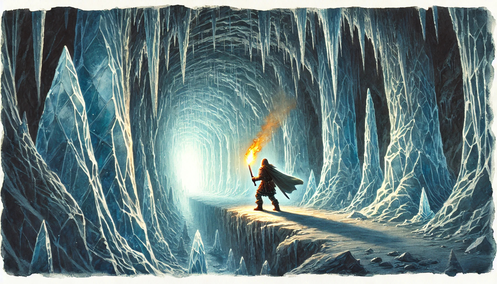
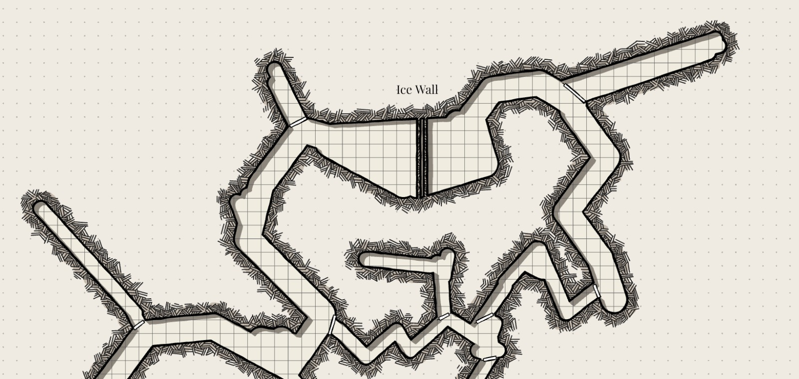

# Adventures

## Module: Levels 1-4

- **Journey to Netrus** Encounter undead, Kobolds, Fungi, Beasts, Madness.
- **Short Quest** "Save" animals for sled (potential werewolf encounter).
- **Acquire Sled** Meet warring tribes (Kobold, Lizardfolk, Yuan-ti).
- **Defend Netrus** Ideally with the help of an ally.

## Level One Adventure: Journey To Netrus

### Introduction

Your journey begins at **Thieves Key**, a notorious halfway point between the civilized world and the icy wilderness of Jhed. Perched in a cove with creaking piers and flickering lanterns, this is a place where **secrets are traded as often as goods**. Thieves, cutthroats, pirates, and outcasts gather here under the watchful eyes of **Brimhest Deepbrew**, the gruff, beer-stained dwarf who runs this lawless haven. Nothing happens here without Brimhest knowing, or at least approving.

The Thieves Key is not for the faint of heart. It's a dark, grimy port where ships come to unload illicit goods and repair battered hulls before venturing further south. The **Dockworks** are filled with the sound of hammering, shouting, and the creak of wooden ships. Dockworkers, visibly branded with marks of loyalty, toil under the ever-present threat of betrayal—a **caged corpse** with a sign reading "Traitor" serves as a stark reminder of what happens to those who cross the wrong people.

Overlooking it all is **Brimhest's Nest**, a lofty perch built into the cliffs, from where Brimhest watches the comings and goings of everyone in Thieves Key. To meet with Brimhest, you'll need to wait your turn in line, or if you're smart, grease the right palms to skip it. Below, in the **Loose Coin**, adventurers and thieves alike seek shelter, though the inn is little more than a series of shanty cubicles where **privacy is a luxury no one can afford**.

This is where your journey begins—a **final taste of warmth and drink** before stepping into the cold jaws of the Jhed Continent.

#### Why You're Here

For weeks, the smuggler's route between **Netrus**—a small but vital frontier town in Jhed—and Thieves Key has gone cold. The last crew sent with essential supplies and trade goods never returned. Netrus relies heavily on these deliveries to survive the harsh winters and to offload the discoveries from the frozen wastes. If the route is not re-established, the town will collapse, and the situation is dire enough that Brimhest has approved your expedition to deliver a **50 lbs package** critical to their survival.

You have been promised **600 gp** to deliver this package, with an additional **100 gp per extra crate** you can carry, but be warned: any lost cargo will cost you **150 gp in penalties**, and if the main package isn't delivered, the entire deal is void.

#### Motivations for Your Journey

As you prepare for the perilous trek ahead, you each reflect on why you’ve taken this risk:

- **Fortune Seekers** Jhed promises unimaginable riches, from rare gems to ancient artifacts hidden beneath the ice. This expedition could set you up for life—if you survive.
  
- **Knowledge Seekers** The icy expanse of Jhed holds **arcane secrets and lost knowledge** from ancient civilizations. You’ve heard rumors of powerful magic trapped in the glaciers, waiting to be unlocked.
  
- **Exiles and Outcasts** Some of you have come to Jhed because there’s nowhere else to go. The world behind you holds **only danger or disgrace**, and the endless snow is the perfect place to disappear.
  
- **Adventurers and Survivalists** For you, Jhed is the **ultimate challenge**—a frozen wasteland that will test every skill and instinct you possess. You crave the thrill of survival against impossible odds.

Whatever your reason, you’ve banded together for this journey. The weather, the creatures, and even the very land itself will try to kill you, but together you might just survive.

### The Smuggler's Tunnel: Your First Steps Into Jhed

Your immediate goal is to reach **Netrus** by navigating the **Smuggler's Tunnel**, which starts at **The Witch’s Nip**, a foreboding entrance to an underground path leading into Jhed. Before you can even think about crossing into the frozen continent, you must survive the **two-day journey by boat** from Thieves Key, through treacherous waters and into the heart of **Roc territory**.

The **Roc**, a massive bird that patrols the skies over Jhed, is a constant threat, forcing smugglers to use these dangerous underground routes. Any attempt to travel overland would end in certain death beneath its talons.

Don Vras, a seasoned smuggler with a **dark past**, will be your ferry captain. As you set sail, he fills the air with tales of the dangers ahead—how the Roc claims vast stretches of territory and how the last crew that attempted this route vanished without a trace. He describes how the Roc’s shadow darkens the waters, a grim omen for anyone daring enough to cross its domain. He has sailed to the **Witch's Nip** many times before.

#### Tasks Before You Leave

Before leaving Thieves Key, you need to make final preparations. You’ll have the chance to **purchase supplies**, gather **information**, and meet with key NPCs who may offer assistance—or try to sabotage your efforts.

- **Supplies**: Ensure you have enough food, cold-weather gear, and rations to last several days in freezing conditions. The journey to Netrus is long and treacherous.
- **Transport**: Secure or steal a sloop to sail to the Witch’s Nip. Don Vras, a seasoned smuggler with a **dark past**, may offer his services as a navigator.
- **Package**: Don’t forget the **50 lbs package** you’ve been entrusted to deliver. If anything happens to it, your mission will fail.
- **Information**: Speak with **Brimhest**, **Don Vras**, and others in the Thieves Key. They may offer **clues** about the dangers ahead, or tips on how to survive the journey. Some may even have ulterior motives.

### The Journey Begins

With your supplies packed and your nerves steeled, you prepare to leave Thieves Key. The smuggler’s boat awaits, its dark wood creaking as it sways on the icy water. Your last taste of warmth fades as the cold air of Jhed creeps closer. From here, you’ll travel through the **Smuggler’s Tunnel**, past the **UnderRoc Bridge**, and into the heart of **Netrus**.

Your quest is simple: **deliver the package**, survive the journey, and perhaps uncover the untold riches of the **frozen wilderness** beyond.

But beware—the last courier crew never made it back.

### Sail and Arrival at The Witch's Nip

Don Vras is a silent individual, as he's ferried his share of adventurers to the **Witch's Nip**

Here's some sayings that Don Vras will spout out at random times:

>    - "Batten down the hatches! Once we set out, the only thing worse than the cold is the company you keep... and I ain’t talking about my fine self."
>    - "I’ll navigate you through these waters, but you’ll have to watch your own backs. You can’t trust anyone out here."
>    - "That Roc has a hunger that would put a troll to shame. Stay low and keep your wits about you—if you see a shadow, choose quickly if you want death at the Roc's stomach or an icy death."
>    - "Remember, lads and lasses, fortune favors the bold! Or was it the stupid? Either way, make sure it’s you with the gold in the end."
>    - "Look at those cliffs—nature’s way of reminding you how small you really are. Don’t get too cozy; the ground is icy and so are the hearts of those who wander here."
>    - "You see that tunnel? It’s not a path to riches; it’s a corridor of doom! Bring back tales of your brave friends... or just their heads. Whichever's easier."
>    - "In my experience, when things get quiet, that’s when you should be worried. Silence is just the calm before the madness takes over."
>    - "This place is a real gem—if by gem, you mean a frozen wasteland where dreams come to die. Hope you brought a good shovel for digging your graves."

After days at sea, navigating treacherous icy waters and avoiding the sharp gaze of the Roc, the sloop finally sails into a narrow inlet known as **The Witch’s Nip**. The biting cold seems to intensify as the boat glides between the towering, jagged cliffs that guard the cove like the fangs of a giant beast. As the crew secures the sloop to the frost-covered dock, a strange, echoing silence replaces the rhythmic lapping of the waves, broken only by the faint, distant howl of the wind.

Before you lies the entrance to the **Smuggler’s Tunnel**—a gaping, dark maw in the rock face, partially hidden by snow drifts and worn ice sculptures of unknown origin. The passage is lined with makeshift torch holders, though none are lit, casting the entire scene in a blue twilight glow. Deep within, the faint, rhythmic sound of dripping water is the only sign that the tunnel hasn't been abandoned for centuries.

### The Smuggler's Tunnel

The **Smuggler’s Tunnel** is a lifeline between **Thieves Key** and **Netrus**, cutting through miles of treacherous terrain that would otherwise take weeks to navigate overland. While at first glance the tunnel may seem like a marvel of ancient craftsmanship, closer inspection reveals its more improvised nature. The stonework is uneven, as if hastily carved by many hands over time, with sections reinforced with mismatched materials. Cracks riddle the walls, and patches of ice creep in through the roof. A narrow river of freezing water snakes through the middle of the tunnel, glistening under the sparse light, barely held back by makeshift barriers.

Your journey through the tunnel will be as dangerous as the Roc-haunted skies above. The path ahead is dark, cold, and fraught with hazards—both natural and unnatural.

**The Tunnel’s Features:**

- The entrance is wide enough for a small boat to enter  and moor, but the river that flows within is more of a sluggish stream than a navigable waterway. It seems to be residual water seeping down from the higher parts of the tunnel.
- Much of the tunnel has an upward incline, making it more of a trek than a leisurely walk. The party will need to watch their footing, as patches of ice make travel treacherous.
- Crude, ice-coated railings line parts of the passage, hinting at past traffic, though they are worn and unreliable in many places.
- The residual water flows slowly but steadily, forming shallow pools and slick surfaces. Sharp rocks and ice floes occasionally jut out, making movement tricky. Any attempts to traverse the tunnel will require **Survival or Dexterity checks** to avoid slipping on the ice or navigating hazardous terrain.
- As the party ventures deeper, they discover that the tunnel isn’t as simple as a straight path. While the main passage stretches onward, there are occasional forks, offshoots, and side passages. These side tunnels lead into smaller alcoves or dead ends—remnants of old excavation attempts, collapsed tunnels, or secret storage areas from smuggling days gone by. Some forks are clearly marked with old **Thieves' Cant symbols** for those trained in its use.

As the party steps into the tunnel, the cold seems to tighten its grip around them. The sound of their boots crunching on the ice and the muted drip of melting snow echoes off the stone walls. The once-bustling trade route now feels eerily deserted, with only the fading remnants of ancient travel signs offering a hint of what once was.

As you prepare to enter, a single torch flares to life in the darkness—a reminder that **someone or something** may be waiting ahead.

>    DM Note:
>    The journey through the Smuggler's Tunnel doesn’t need to follow a linear path. Tailor the experience based on the party’s composition and decisions. They may navigate primarily through the Boarded Walls or face the Ice Wall.
>    
>   If the party gets stuck, introduce Kresh and Krew to assist them. The goal is to keep the adventure dynamic and engaging, ensuring that each encounter feels fresh and responsive to their actions.

#### Encounter: Boarded Wall

As the tunnel twists and narrows, the party will come across several makeshift wooden barriers erected by past smugglers and thieves. Each is marked with **Thieves’ Cant**, warning of the dangers ahead. A **Rogue** or anyone who can read the code will recognize the symbols, which indicate traps, potential ambushes, or secret passages hidden behind the walls.

Scattered along the path, **boarded walls** present a challenge: **destroy them and risk traps** or **find another way around**. Some paths behind the walls could be shortcuts, while others may hide deadly hazards. The decision is up to the players.

A rogue investigating can be told the result of their roll before destroying the blockade. Each path must be traveled for about 30 minutes before the result happens.

| D6 | Behind Wall |
|----|-------------|
| 1  | Too Cold    |
| 2  | Trap        |
| 3  | Dead        |
| 4  | Danger Hole |
| 5  | Split       |
| 6  | Bypass   |

1. **Too Cold** The path is long and cold. The party takes 1 Cold Damage.
2. **Trap** Investigation Check (DC 10) to notice the trap. Dexterity Save (DC 10) to avoid 1d4 Bludgeoning Damage as the roof caves in, making the path impassable.
3. **Dead** A corpse slumped to the ground, wearing scraps (Zombie). The party is surprised if they move towards it.
4. **Danger Hole** A half-eaten Kobold lies near a deep hole. Investigation (DC 13): There's water in the hole. It could trigger a Lizardfolk ambush.
5. **Split** The path splits in two. Each path requires a new D6 roll and can split again.
6. **Short Cut** An hour down the path reveals a shortcut. If the party has already found this, replace it with a "Too Cold" result.

#### Encounter: Ghost of the Past I

>    DM Note:  After the party wakes from their first short rest.

As the party rests for the first time inside the tunnel, something unsettling happens. In the stillness of the frozen caverns, as the campfire flickers and begins to die down, an ethereal form materializes. Barely visible, refracted through the ice walls, it speaks in a voice that is both chilling and mournful:

**"Will you be any different?"** it asks in **Old Common**, the words echoing in the icy wind. The figure lingers for only a moment before fading into the frozen darkness.

This ghostly figure does not engage the players directly but serves as a haunting reminder that many have come before them—and not all made it out.

#### Encounter: Kresh and Krew

The faint sound of iron against ice echoes before stalagtites above you buckles and breaks. Three hulking Lizardfolk fall from above.  
  
They only speak Draconic, but clearly have climbing gear, tools and will help the party for trade through gestures if no party member speaks draconic  
  
Kresh and Krew won't stick around to help the party further and dig down to the waters

Lizardfolk names should all start with "Kr"

#### Encounter: A Wall of Ice

>    DM note: quick simple obstacle

As the party ventures deeper into the Smuggler’s Tunnel, the cavern opens wide, revealing a formidable wall of ice that blocks the way forward. Chunks of debris are haphazardly stacked, remnants of a violent tremor that once split the passage. The jagged ice wall looms 25 feet above the highest pile of debris, and a shadowy figure—a Kobold—can be glimpsed at the top, briefly taking interest before darting away, leaving a sense of foreboding in its wake.

Characters attempting to climb the wall will suffer 1 piercing damage from the sharp terrain if they use their climb speed. Those without a climb speed will require assistance (e.g., climbing gear, rope, or pitons).

You may increase the challenge by having the Kobolds use the opportunity to ambush the party, hiding in the shadows and potentially shoving characters or cutting ropes when they reach the top.

| Check         | DC | Pass                                        | Fail                              |
|---------------|----|---------------------------------------------|-----------------------------------|
| Athletics     | 13 | Climb over the wall                         | 1d6 bludgeoning damage, 2d6 if failed by 10 or more |
| Survival      | 13 | Learn that the wall is climbable, but will hurt a bit |                                   |
| Perception     | 16 | Shadows of Kobolds hint they are moving away |                                   |
| Investigation  | 13 | Tracks lead back into the Boarded Walls (bypass) |                                   |

#### Encounter : Remnants of the Trade Party

As the main tunnel forks, a **Boarded Wall** to the left has been smashed open, and trails of blood lead in both directions, hinting at recent violence. 

Just past the boarded wall, tucked in an alcove, lies a makeshift wooden barrier behind which a few corpses (six in total) are scattered about. They wear the tattered clothing of the **Outer Empire**, but they are devoid of weapons, armor, or gold, as if they were picked clean. Something large has taken bites from the bodies, with evidence of both giant-sized and smaller bites.

**Surprise Encounter**:  If the party moves closer or investigates around the bodies, **2-4** of the corpses will suddenly rise as **Zombies**, surprising the party and adding a sense of urgency to the encounter.

**Oniteth the Scouter**: Female Goliath (frost) Survivor.

>    DM note: avoid giving another NPC a glaive

Among the chaos, hiding behind the makeshift wooden barrier and through a crawlspace, **Oniteth**, a female Goliath survivor, is trembling with fear. She looks gaunt and close to death, shaking while gripping her glaive tightly (she will not give it up). Oniteth wears the garments of the **Outer Empire** and appears visibly shaken.

**Dialogue:**
> "Apologies, and thank you! I hate it, but I can't handle the frontline now. I have an important letter for Nick Elder of Netrus; it's the only thing I could safeguard."
>
> "I was stationed at UnderRoc searching for this group when something giant started thrashing about, and I just hid."

| Check          | DC | Pass                                           |
|----------------|----|------------------------------------------------|
| Survival       | 10 | Easily fortified area for a Short Rest        |
| Insight        | 10  | She's in shock and trying to survive          |
| Insight        | 19 | She is hiding something                        |
| Investigation   | 13 | The Boarded Wall was broken from the outside  |
| Medicine       | 10 | Oniteth is Exhausted                          |
| Medicine       | 13 | Remnants of poison (unknown) powder on the dead |

**If party is Hostile to Oniteth:** If the party shows hostility towards her, Oniteth will cast **Charm Person**, **Sleep**, or **Gaseous Form** to escape, trying to protect herself in her vulnerable state.

#### Encounter : UnderRoc Tower

>    DM Note: A series of 3 combats in one. Stay in initiative order, and if players don't act after 3 rounds, the Kobolds will act (either run, attack, or bargain). Kobolds in J'héd always involve traps and will attack to gain Pact Tactics, retreating when only one is left.

**Weather Conditions:**

| Weather | Normal | Lightly Obscure | Heavily Obscure |
|---------|--------|-----------------|-----------------|
| Fog     | 60ft   | 60ft+           | ----            |

**Encounter Breakdown:**

| Encounter         | Creature | Number | Notes            |
|-------------------|----------|--------|------------------|
| Outside Tower     | Kobold   | 4      | Hunter's Trap     |
| Ground Floor      | Kobold   | 3+     | Alchemist's Fire  |
| Top Floor         | Kobold   | 6+     | Caltrops          |

The tunnel opens up to a cliffside where a bridge connects two towering cliffs. At either end of the bridge stands a stone tower, each two floors high with arrow slits and vantage points, domed and covered at the top. The bridge stretches a daunting **600 feet** long, shrouded in fog.

##### Bridge Entrance

The Kobolds would rather complete a trade and run away. They search for food, treasures, and dragons.

| Check           | DC | Result                                                   |
|-----------------|----|----------------------------------------------------------|
| Sleight of Hand | 13 | Disarm the Hunter Trap if noticed                       |
| Stealth         | 7  | The party backs away to find another path               |
| History         | 16 | The bridge was built by the Zeltrin Empire              |
| Investigation    | 13 | Identify the Hunter's Trap in the snow                  |
| Insight         | 10 | The Kobolds seem ready to act                            |
| Perception      | 10 | Hear Kobolds speaking Draconic, waiting for orders from a Kobold Aspirant |
| Intimidation    | 13 | The Kobolds retreat into the keep                        |
| Persuasion      | 10 | Trade for passage                                        |

>    DM Note: If the characters prefer to avoid combat, there is a cost involved; they must trade at a loss.

**Trade**: The Kobolds are very demanding. When they see the party carrying the crates, they become very interested. If you wish to trade for passage, they will ask for **1 Quest Crate** and one of the following: all your rations, all your coins, or all your weapons. The Kobolds don't have the patience to do numbers, so they only like to trade in all-or-nothing values.

**Combat**: The first player to move triggers a Hunter's Trap. If Kobolds are killed before they act, do group Stealth DC 13 to not alert the other Kobolds. (Refer to group checks in the PHB 2014). If the Kobolds are alerted, 18 seconds after combat (3 rounds), D4 Javelins will be thrown from the top of the tower by 3 Kobolds.

##### Tower Ground Floor

Upon entering the floor is cluttered with broken crates and remnants of supplies. A scarred wooden table in the center holds stained maps to Netrus, while a barricade of crates conceals a few alert Kobolds. A sudden crash from above echoes through the chamber, hinting at chaos within.

**Alchemist's Fire** drops on the first person to walk through the door, which can cause panic during combat.

**Combat Mechanics**: If alerted, 3 Kobolds plus the ones that fled from outside hide in crates. They surprise attack once, then run to the top floor. The Alchemist's Fire will drop on the first person to walk through the door.

**Non-Combat Option**: The party can be permitted to lower the tower floor and stairs, but opening the top floor leads to combat. A crawl space behind a looted shelf can also be discovered.

##### Crawl Space

Inside the crawl space, the party finds a **dead guard** in Outer Empire clothing (wearing a chain shirt), along with two notes, **7gp, 14sp, and 98cp**.

- **Note One**: "Yalna, I told you I was coming home soon. I know I could have done better. I wish I wasn't such a coward in these moments, but I am trying."
- **Note Two**: "Captain Faotil has been locked in his chamber for weeks. A delivery came for him, and he hasn't left. Scouts report sightings of lurking creatures encroaching the pass—no confirmations. The undead have increased in numbers, and we have requested aid. Everyone is on edge."

| Check           | DC | Result                                                   |
|-----------------|----|----------------------------------------------------------|
| Sleight of Hand | 13 | Disarm the Alchemist's Fire if noticed                  |
| History         | 16 | The bridge was built by the Zeltrin Empire              |
| Investigation    | 16 | Alchemist's Fire above the door                          |
| Investigation    | 13 | Discover the crawl space behind the looted shelf         |
| Medicine        | 10 | The guard starved to death                               |
| Perception      | 10 | Hear Kobolds speaking Draconic, waiting for orders from a Kobold Aspirant |
| Intimidation    | 13 | The Kobolds retreat into the keep                        |
| Persuasion      | 10 | Trade for passage                                        |

##### Officer Quarters

**Puzzle Mechanics**: Halfway up the steps to the top floor An intricate inverted triangular stone door, about 9ft tall, stands before the adventurers. There is no consistent pattern upon the frame or door, but a stone brazier is carved into it.

Casting a cantrip within 30ft of the door fails, but the door glows as the caster feels the energy of the spell drawn to it. Brandishing a magic item will have a similar effect, but will not remove the magical properties of the item.

| Check         | DC | Result                                          |
|---------------|----|-------------------------------------------------|
| Arcana        | 10 | Door Magically Shut                            |
| Arcana        | 16 | Arcane Symbol for Fire                         |
| History       | 13 | Stonework resembles Council Five               |
| Perception    | 7  | Ash and soot marks on floor, wall, and ceiling|
| Perception    | 13 | Shadows indicate movement nearby               |
| Investigation | 10 | Burnt parchment and broken glass in brazier   |
| Investigation | 16 | Loose brick hiding Fog Cloud scroll            |

| Solution                               | Effect                      |
|----------------------------------------|-----------------------------|
| Burn a spell scroll or potion in the brazier | The door opens                  |
| Cast a leveled spell                     | The door opens                  |
| Force it open with DC 19 Athletics      | The door opens, setting off a ward |
| Use Thieves' Tools with DC 19 Sleight of Hand | The door opens, setting off a ward |

**Setting Off the Ward**: All creatures within 30ft of the door must make an Intelligence Save DC 13, taking 1d6 psychic damage on a failed save.

With a plume of red smoke, the arcane lock opens, and the door will remain open for 1 hour (even if forced open).

##### Tower Top

At the top of the tower, the party will encounter 6 Kobolds and 1 Kobold Aspirant, plus any Kobolds that fled earlier.

**Stealth Check (High):** Automatic failure if alerted; the party will notice 6 or more Kobolds preparing to flee.

**Combat**: The Kobolds will all throw javelins at the players before swinging down to escape. They will cut any extra lines and can keep a few Kobolds behind for a fight.

**Another Route :**
An Investigation Check (High, automatic pass if using Thieves' Cant) reveals a tunnel big enough to crawl through and move crates. It seems to snake its way near the bridge but is not large enough for a wagon. The party can then proceed to the Underpass.

#### Encounter: Underpass

Squeezing through a tight corridor leads underneath the UnderRoc bridge revealing a hidden yet very intentional passage through the middle that can be crawled through. The stonework can be almost too clean.

Investigation Check DC13: The stonework seems to be washed by acid

Grey Ooze: moving along the corridor is a grey ooze, a still oil slick patch of wet stone and will attack when the party crosses. 

>    DM Note: Attack the highest hitpoint target as the ooze does 3d6+1 damage and can crit. If the party wants the campaign to be difficult simply attack who is leading the party

